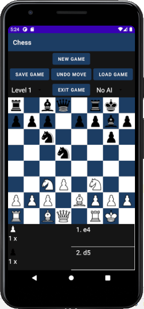
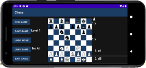

A simple 2 player chess AI that implemented minimax & alpha-beta pruning & pawn structure analysis & move ordering to fully optimise alpha-beta pruning

## Folder Structure

The workspace contains two folders by default, where:

- `src`: the folder to maintain sources

## To play the Game

No. | Steps
--- | ----
1.| User can choose to play as white/black
2.| User can choose white/black as AI
3.| Once the game started, click the piece you wish to move, and click to the square you wish to place it

## Game Features

NOTE: **if AI move is undo, press the Slide Down Menu to choose AI player again**

No. | Features
--- | ----
1.| Restart new game
2.| Save game/ Load saved game
3.| Exit game
4.| Highlight legal moves
5.| Show move history
6.| Choose AI level from 1 to 4
7.| Show captured piece
8.| Undo previous move
9.| Multithreaded to enhance improve AI thinking time
10.| Playable on both portrait and landscape mode
11.| Flip board
12.| Show AI Thinking Progress Bar
13.| Choose 6 different board color
14.| Show previous move made by others(HUMAN/COMPUTER)

